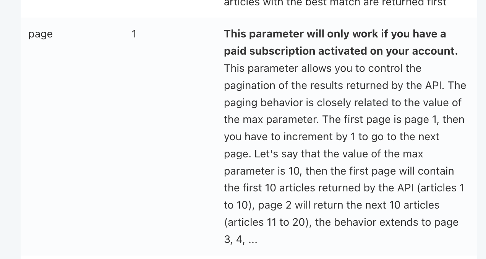
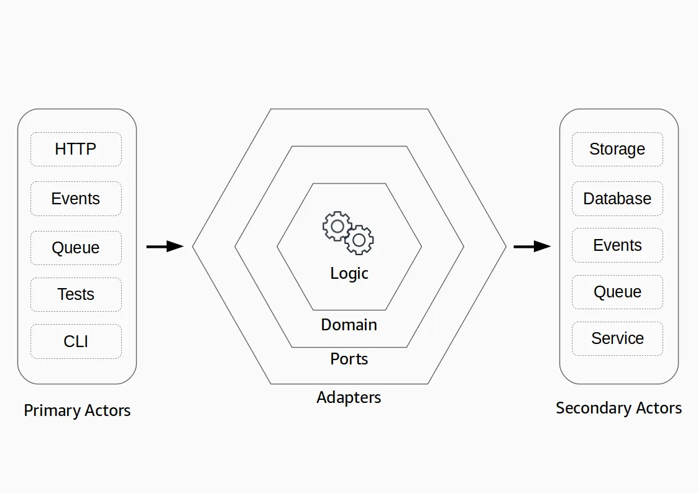

# News API

This project is a simple example of API using a variant of hexagonal architecture.

## Testing the Application

#### 1. Create an GNews account and get an apikey.
You need to save  ```GNEWS_APIKEY="8a.............24e"``` into a ```.env``` file.

All other configuration parameters are saved into ```./src/utils/environment.mjs```


#### 2. Install the necessary dependencies
```bash
npm install
```

#### 3. Start the News API
```bash
npm run start:newsApi
```

#### 4. Run unit tests:
```bash
npm run test
```

## API Documentation

After the application is up and running, the API documentation can be accessed via [Swagger UI](http://localhost:3000/api-docs/#/Articles/get_api_v1_search).

## Solution decisions

### Caching

For simplicity, caching is managed internally within the application itself. For a more robust and scalable solution, a dedicated caching service like Redis is recommended.

The cache has a TTL of 24hrs.

### Pagination

Note that pagination is not supported, as it is not a feature available in the free tier of the GNews API.


### Authentication

Authentication or Authorization policies are not supported from the newsApi.

### API Endpoints

The API exposes a GET method to search in the article title or in the content and description of the article.

### Architecture

The project is developed using a [variation of hexagonal architecture](https://medium.com/@daaru/lambda-hexagonal-architecture-variation-deb8612672cb).



Thanks to [Fabio Gollinucci](https://daaru.medium.com/)

#### Primary adapter
Entry point ```src/adapters/primary/newsApi.mjs```

#### Secondary adapter
Integrations to extenal API ```src/adapters/secondary/gNewsApi.mjs``` or storage ```src/adapters/secondary/cache.mjs```
 
#### Ports
Connector between adapters and domain logic ```src/ports/newsApi.mjs```

#### Domain
Application logics ```src/domains/newsApiContents.mjs``` ```src/domains/newsApiTitle.mjs```


